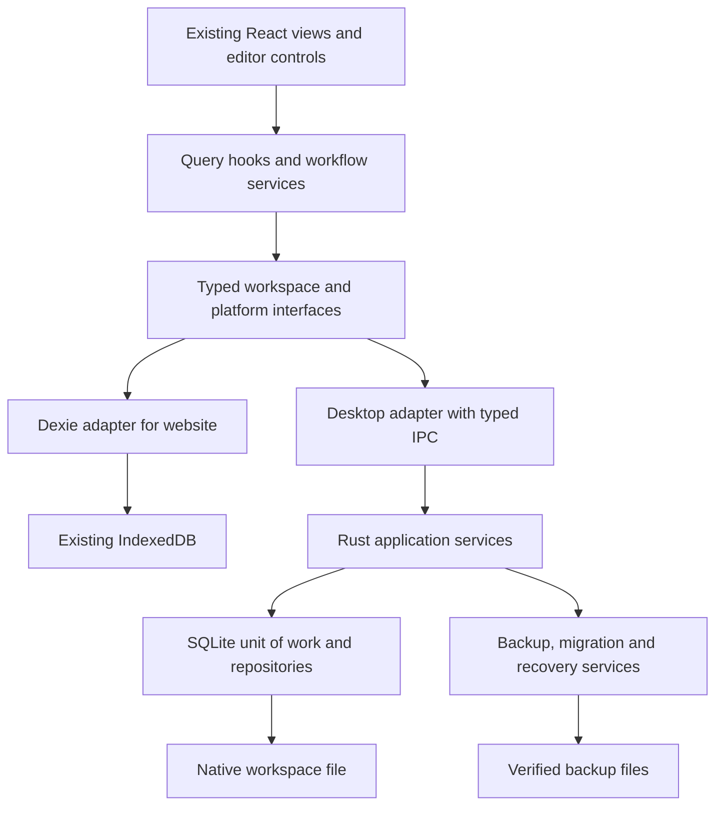

# PRD: Kanban Calendar desktop application and durable local storage

Status: proposed implementation specification. Date: 18 September 2026.

Owner: Ryan. Initial platform: Windows 11 x64. Delivery estimate: **10 implementation sessions plus 2 contingency sessions**, executed sequentially. This document does not begin implementation or schedule background work.

## 1. Product outcome

Provide an installable Windows application that retains the current Kanban Calendar experience and saves work locally outside browser-managed storage. Clearing Chrome/Edge history, cookies, site data, or the desktop WebView's cache must not delete the desktop workspace.

Protect acknowledged saves through transactional writes, preserve recoverable drafts, create verified automatic backups, and provide understandable recovery when storage fails. No product promise should imply immunity to disk failure, deliberate file deletion, malware, or loss of the device.

The existing website/PWA remains supported. The desktop application and website are independent workspaces after migration; “live” means edits appear and save promptly within the application, not cloud or browser-to-desktop synchronization.

## 2. Verified starting point

The released baseline is main commit `e7c54a0`, which merged PR #9. The current local `codex` checkout is `bd1c928`, whose application changes are included in that merge. GitHub Quality, CodeQL and Pages deployment passed for the merged baseline; the published application revision and its main routes were verified.

| Existing area         | Current implementation                                                                              | Integration implication                                                                                                          |
| --------------------- | --------------------------------------------------------------------------------------------------- | -------------------------------------------------------------------------------------------------------------------------------- |
| Frontend              | React 19, TypeScript 6, Vite, reusable feature components                                           | Reuse views and styling; introduce platform services at composition boundaries.                                                  |
| Persistence           | `Database` extends Dexie; IndexedDB schema version 4                                                | A desktop WebView wrapper alone would retain browser-storage risk. Desktop must use a native database file.                      |
| Repository            | `WorkspaceRepository` owns validation and multi-table transactions, exposes its concrete `database` | Extract interfaces without exposing Dexie tables or query chains to consumers.                                                   |
| Workflow coordination | Injected `WorkItemActions`; confirmations and mutation helpers                                      | Preserve orchestration; depend on interfaces rather than concrete repository classes.                                            |
| Reactive reads        | `useLiveQuery` appears in 11 source files                                                           | SQLite writes do not automatically refresh these subscriptions. Introduce and test a platform-neutral query subscription layer.  |
| Text editing          | 550 ms debounce, serialized draft saves, expected field values and dataset-generation checks        | Preserve conflict semantics. Existing draft memory does not survive forced closure; desktop requires a durable recovery journal. |
| Backup/restore        | JSON format version 1, encrypted envelope version 1, validation and transactional replacement       | Keep portable formats compatible. Separate codec/validation from database-specific operations and file delivery.                 |
| Recovery snapshots    | Up to five snapshots inside the same IndexedDB database                                             | These are not independent backups and do not protect against removal of that database.                                           |
| Delivery              | GitHub Pages PWA, service-worker update prompt and offline resources                                | Maintain the web pipeline; desktop bundles its frontend and uses a separate update lifecycle.                                    |
| Verification          | 39 unit tests; 28 browser tests; root and `/Kanban/` builds                                         | Retain these as baseline coverage and add real SQLite/native tests. Browser tests alone cannot certify a native installer.       |

Architecture references: [code organization](ARCHITECTURE.md), [domain model](../src/domain/model.ts), [repository](../src/repositories/workspace.ts), [drafts](../src/services/drafts.ts), [backups](../src/services/backups.ts), and [workflow coordinator](../src/services/workItemActions.ts).

## 3. Scope and boundaries

### Required for the first desktop release

- Windows installer, Start menu entry, standalone application window and offline operation.
- Functional parity for boards, projects, tasks, lifecycle/history, ordering, tags, search, archive, calendar, notes, settings, and import/export.
- Native SQLite storage, automatic verified backups, recovery UI, durable draft recovery, and safe upgrades.
- Explicit migration from the current web app through existing JSON/encrypted exports.
- Existing PWA behaviour and deployment remain available throughout development.

### Not included

- Cloud sync, accounts, collaboration, automatic two-way web/desktop synchronization, mobile apps, macOS/Linux packaging, attachments, and arbitrary database-folder relocation.
- Guarantees against device failure without a second backup location, or against an administrator deliberately removing app data.
- A new visual redesign, unrelated dependency majors, and a manual screen-reader certification programme.

**User decision:** manual screen-reader testing is waived and is not a release blocker. This supersedes older handoff statements requiring it. Retain existing keyboard navigation, focus handling, labels, and automated checks; do not remove working usability features.

## 4. User experience and requirements

| ID  | Requirement and acceptance condition                                                                                                                                                                          |
| --- | ------------------------------------------------------------------------------------------------------------------------------------------------------------------------------------------------------------- |
| D01 | Install and reopen from Windows without running a development server. Core workflows work with network access disabled after installation.                                                                    |
| D02 | Store canonical work in the app's native data directory, never IndexedDB, localStorage, the installation folder, a cache directory, or a temporary directory. Clearing browser/WebView data must preserve it. |
| D03 | Display “Saved” only after the native transaction has committed successfully. Failed writes retain the text, show a useful error, and provide recovery/export.                                                |
| D04 | Preserve all existing lifecycle rules and atomic operations, including project creation/deletion, child ownership, history, completion, archive and restore.                                                  |
| D05 | Automatically refresh all affected views following a commit. A failed transaction produces neither a success notification nor a published data-change event.                                                  |
| D06 | Close/update normally only after pending drafts are committed or the user explicitly chooses to retain them for recovery. Never silently discard a failed draft.                                              |
| D07 | On next launch, offer recovery of journalled drafts after an abrupt process exit. Do not silently apply a stale draft after a restore or conflicting edit.                                                    |
| D08 | Settings shows storage location, last successful backup, backup failures, “Back up now”, “Restore backup”, and optional additional backup folder. Normal use must not require knowledge of SQLite.            |
| D09 | A second launch focuses the existing desktop window. One application process owns the active workspace in v1; multi-window editing is deferred.                                                               |
| D10 | Ordinary upgrade, repair and uninstall/reinstall preserve user data by default. Any installer behaviour that removes data must be disabled. Explicit in-app deletion remains separately confirmed.            |
| D11 | Start fresh and Import existing work are clear first-run choices. Import preview and confirmation occur before changing an existing desktop workspace.                                                        |

### Save and backup guarantees

- Acknowledged save recovery target: no lost acknowledged transactions in process-kill/restart tests. SQLite settings and actual filesystem behaviour must be tested; do not claim physical-disk failure protection from transactions alone.
- Pending text: retain the current 550 ms save debounce. Persist a recoverable draft within a target of one second under normal load, with a separate acknowledgement. A crash before either acknowledgement may lose recent keystrokes; “Saving…” must not imply durability.
- Desktop draft records contain text, field/item identity, expected original value/revision and dataset generation. They do not persist callbacks or executable objects. Clear a draft journal entry atomically with a successful canonical save, or use a tested revision protocol that cannot resurrect a saved draft.
- Automatic backups: after the first successful change, then within five minutes of further changes while running; perform overdue work on resume/startup. No background service is required while the app is closed.
- Retain the latest 12 rolling backups, 7 daily and 4 weekly restore points, deduplicated when one file satisfies multiple categories. Show space usage; prune only after a replacement backup validates, and never remove the last verified copy because a new backup failed.
- Preserve a verified pre-operation backup before replacement import, recovery restore, clear-all and schema migration. If this backup cannot be made, block the destructive operation and explain how to free space or choose another destination. Ordinary individual item deletion keeps its current confirmation flow.
- Offer a user-selected second backup folder. If unavailable, local saves continue and the UI reports that the additional backup is overdue. Same-drive backups protect against some corruption and mistakes, not drive loss.
- Initial supported data envelope: the current scale fixture (1,000 active tasks, 3 projects, 10,000 archived tasks, 25,000 events and 20 columns), plus the existing 1,000,000-character text cap and 100 MB import limit. Measure the upper import limit without freezing the interface.

## 5. Architecture and design principles

### Recommended approach

Use Tauri 2 with the existing React frontend and a native Rust service owning SQLite. This is a proposed design, not a dependency already installed. Select and pin compatible Tauri/Rust/SQLite library versions during session 1; retain TypeScript 6 until the lint parser supports a later major.

Tauri offers SQLite support, but the official SQL plugin exposes frontend query execution. For this project, prefer narrowly scoped native commands whose entire business mutation executes in one native transaction. Do not implement `BEGIN`, several independent frontend calls, and `COMMIT` as if connection ownership were guaranteed. The session-1 spike must verify transaction, backup, and connection-lifecycle support before choosing the Rust database library. [Tauri SQL documentation](https://v2.tauri.app/plugin/sql/)

### Responsibilities and boundaries

| Component                                    | Responsibility                                                                                | Must not do                                                                    |
| -------------------------------------------- | --------------------------------------------------------------------------------------------- | ------------------------------------------------------------------------------ |
| `WorkspaceQueries` / `WorkspaceCommands`     | Typed application operations and DTOs, including expected revision/generation                 | Return Dexie tables, SQL strings or platform handles to components.            |
| `DexieWorkspaceRepository`                   | Adapt the current repository to those contracts                                               | Change existing web data or schema solely to introduce an interface.           |
| `DesktopWorkspaceRepository`                 | Map contracts to typed native calls and normalize errors                                      | Perform sequences of independent IPC writes for one atomic business operation. |
| `WorkspaceQueryStore` and React hooks        | Subscribe, cache scoped results, invalidate and refetch after commits                         | Keep two independent authoritative copies of persisted state.                  |
| `WorkItemActions` and editor services        | User confirmations, draft state and workflow orchestration                                    | Import native SQL or filesystem code.                                          |
| Rust workspace service and repository traits | Enforce desktop rules using a unit of work with one transaction owner                         | Trust arbitrary renderer inputs or expose unrestricted SQL/path access.        |
| Backup codec                                 | Validate/encode the portable JSON and existing encryption envelope                            | Know where files are stored or mutate the active database.                     |
| Native backup/recovery/migration services    | Consistent snapshots, validation, retention, restore and schema lifecycle                     | Treat file-copy success as proof of a restorable backup.                       |
| `PlatformServices` composition root          | Choose web or desktop services once at startup; inject clock/IDs/storage/update/file services | Scatter platform checks across feature components.                             |

Use cohesive classes for TypeScript services that own dependencies or lifecycle, and Rust structs/traits for corresponding responsibilities. Keep React composition and pure domain functions; do not introduce component inheritance or generic base classes merely to claim OOP. Apply single responsibility, dependency inversion, small interfaces, explicit error handling and consistent formatting. Prefer domain operations over a universal CRUD framework.

Cross-language policy is a deliberate cost: existing TypeScript domain functions cannot simply execute inside a Rust transaction. Keep UI policy in shared TypeScript; implement authoritative native invariants in Rust and keep the web adapter's equivalents. Use versioned DTOs and shared JSON behaviour fixtures to prove both backends agree on transitions, validation and failure cases. Contract/schema changes must update both implementations together; no undocumented duplicated rules.

### Reactive reads and concurrency

Replace direct `useLiveQuery` usage incrementally with application query hooks. The web implementation may use Dexie internally. Desktop publishes a committed workspace revision plus affected entities after a transaction; subscriptions invalidate narrowly and refetch. Subscribe before the initial read and reconcile revision gaps so an update during startup is not missed. Discard stale query responses after route/key changes; unsubscribe on unmount.

Retain expected field values and generation checks in the same transaction as text writes. Use revision checks for read-modify-write native operations and typed conflict errors. Restore/import assigns a fresh generation and invalidates all queries. A failed native connection must show a recoverable error, never fall back silently to an empty IndexedDB workspace.

### Native schema and storage

Use a stable application identifier and Tauri's app-local-data resolver. A proposed layout is `data/workspace.sqlite`, `backups/`, `recovery/`, and redacted diagnostics under the resolved application directory; do not hardcode a username or exact Windows path. The final installer must prove those directories survive WebView clearing and upgrades. [Tauri path API](https://v2.tauri.app/reference/javascript/api/namespacepath/)

Map boards, columns, items, events, tags, relations, scratchpads, settings and generation metadata explicitly. Preserve UUIDs, revisions, fractional ordering keys, timestamps, local-date strings, and nullable lifecycle fields. Design indexes around active-board reads, project children, ordered archive pagination, relation lookups and history. Preserve case-insensitive uniqueness semantics across runtimes rather than assuming SQLite's default collation matches JavaScript.

Review foreign keys carefully: existing history can refer to a former column, and archived items can validly refer to a removed column. Do not add constraints that reject currently valid exports or cascade away history. Exercise these cases in shared contract fixtures.

Use one managed writer, bounded lock waits, enabled foreign keys and explicitly configured durability. WAL with `synchronous=FULL` is the initial candidate, subject to the spike and crash tests. Keep the live database on a local filesystem, not a network share or a folder selected for cloud-file synchronization. WAL has connection/checkpoint considerations and associated files; do not copy only the live `.sqlite` file as a backup. [SQLite WAL documentation](https://www.sqlite.org/wal.html)

## 6. Migration, recovery and update flows

### Existing browser workspace to desktop

1. In the current browser profile, flush or resolve drafts and export JSON or an encrypted backup. The desktop app cannot assume access to another browser's IndexedDB.
2. Select the exported file through the native picker. Validate format, size, identity, relationships and ordering; show a summary before import. A wrong password or invalid file changes nothing.
3. If desktop data already exists, require replacement confirmation and create a verified safety backup. Merge-import remains out of scope.
4. Import all canonical entities in one transaction, preserving identities and history. Set a new dataset generation. Internal IndexedDB indexes and recovery snapshots are not part of portable backup v1 and must not be presented as transferred.
5. Verify counts and a normalized semantic export comparison, then reopen and check representative tasks, tags, project children, notes and archive pages. Duplicate import must require confirmation rather than silently append records.
6. Leave the original browser data and export intact. Explain that future desktop and browser edits are independent. Desktop continues exporting compatible v1 canonical data so returning to the website remains possible while features remain compatible.

### Automatic backup and recovery

Use a SQLite-consistent snapshot mechanism such as the Online Backup API, with temporary output, explicit close/flush, validation and atomic publication on the same filesystem. A candidate driver must support the selected method. Backup metadata records schema/app versions, creation time, workspace revision and checksum. The checksum detects file changes; it is not proof that all business data is valid. [SQLite Online Backup API](https://www.sqlite.org/backup.html)

Validate generated backups and restore candidates using database integrity, foreign-key checks and domain invariants. `integrity_check` does not cover foreign-key violations; run both checks. Use a bounded startup check and scheduled full checks appropriate to dataset size. Run full validation before admitting a restore candidate. [SQLite integrity and foreign-key checks](https://www.sqlite.org/pragma.html#pragma_integrity_check)

On corruption, preserve the original files and journals, disable unsafe writes, and present validated restore points. Never overwrite the only damaged copy or automatically initialize an empty workspace. Restore first into a staging database; validate it; stop writes and close all connections; publish using a crash-recoverable swap protocol; reopen; assign a fresh generation; then refresh views. Test interruption at every swap stage and recovery from a partially completed restore. Retain a pre-restore copy until the replacement has reopened successfully.

Distinguish missing storage from an intentional first launch: record installation/workspace identity outside WebView storage and check for backups. Missing files for an existing workspace enter recovery rather than silently appearing as a fresh account.

### Updates and schema migrations

Bundle the frontend inside the desktop package. Do not load the live GitHub Pages site with native privileges. Disable PWA service-worker registration in the desktop build; retain it for the website.

Use forward-only, versioned migrations with a ledger/checksum and tested pre-migration backups. A newer database opened by an older app must produce an incompatibility message, never a destructive downgrade. Application rollback and data rollback are separate: restore the matching backup into a recovery copy and preserve newer data before using an older binary.

The first release may use verified manual installer upgrades. Add an in-app updater only with a configured signature-verification path, offline/error behaviour, draft flushing, pre-upgrade backup and tested restart. Never ship an insecure placeholder updater. Tauri updater signatures and Windows installer code signing are separate release concerns. Decide installer signing availability in session 1 and finalize it before general distribution; an explicitly labelled personal preview may precede that. [Tauri updater](https://v2.tauri.app/plugin/updater/), [Windows packaging](https://v2.tauri.app/distribute/windows-installer/)

Use restrictive Tauri capabilities, typed command validation, parameterized SQL, scoped native file access and external-browser handling for outside links. Do not log note contents, backup passphrases or complete imported records. Local storage is not automatically encrypted; keep existing encrypted portable exports and label local automatic backups accordingly. Whole-database encryption is deferred unless requested. [Tauri capabilities](https://v2.tauri.app/security/capabilities/)

## 7. Quality gates and release acceptance

| Gate                 | Required evidence                                                                                                                                                                                                                                                                                                                           |
| -------------------- | ------------------------------------------------------------------------------------------------------------------------------------------------------------------------------------------------------------------------------------------------------------------------------------------------------------------------------------------- |
| Existing product     | All 39 baseline unit tests and 28 browser journeys retained or deliberately mapped to equivalent coverage; web builds pass at `/` and `/Kanban/`. No skipped failing tests or increased retries to mask races.                                                                                                                              |
| Backend parity       | Shared contract fixtures pass against Dexie and real SQLite for CRUD, ownership, lifecycle, ordering, pagination, search/tags, field conflicts, generation changes, import/export and transaction rollback.                                                                                                                                 |
| Native durability    | Terminate a disposable app process during saves and reopen: all acknowledged commits survive; interrupted transactions leave no partial project/history changes; journalled drafts are recoverable.                                                                                                                                         |
| Browser independence | In a disposable Windows profile, create desktop work, clear browser and WebView site/cache data, restart desktop and verify exact contents. Never run destructive acceptance against the user's real browser profile.                                                                                                                       |
| Recovery             | Inject truncated/corrupt database copies, invalid backups, disk-full/permission errors, locked files, unavailable second backup location and interrupted restore/migration. Preserve original data and report actionable errors.                                                                                                            |
| Backup correctness   | Create a snapshot while writes occur; restore to a separate workspace and validate a consistent committed revision. Verify retention boundaries, sleep/resume, failure signalling and last-valid-backup protection.                                                                                                                         |
| Migration            | JSON and encrypted v1 imports preserve canonical fields and relationships. Wrong passphrase, unsupported version, duplicate IDs and invalid relationships do not mutate existing data.                                                                                                                                                      |
| Native experience    | Real Windows application tests cover startup, creation, ordering, notes, lifecycle/history, import/export, recovery, close/reopen, offline use, second launch and upgrade.                                                                                                                                                                  |
| Distribution         | Install, upgrade, repair and uninstall/reinstall in a disposable Windows environment; data remains intact. Handle missing WebView2 explicitly and document any first-install download requirement.                                                                                                                                          |
| Security             | No workspace-content network requests, no unrestricted renderer SQL/filesystem access, no remote privileged frontend, redacted logs, and native test-control features absent from production builds.                                                                                                                                        |
| Performance          | On an agreed reference machine: p95 ordinary native commit under 200 ms; save indicator settles within 1 second including debounce; active-board open within 2 seconds and first archive page within 1 second on the scale fixture. Measure cold/warm results separately. These are proposed acceptance targets, not existing measurements. |

Keep TypeScript formatting/lint/typecheck and existing Vitest/Playwright workflows. Add Rust formatting, Clippy, native unit/integration tests and a Windows build job. Existing CodeQL coverage must not be represented as analysis of newly added Rust code unless that coverage is explicitly configured and supported.

Prototype real native test automation in session 1. Tauri currently documents WebdriverIO with its Tauri service, including native and embedded-driver choices. Pin a tested approach and keep any embedded automation plugin restricted to test builds. Mocked IPC/browser tests are useful but do not replace native persistence tests. [Tauri WebDriver guidance](https://v2.tauri.app/develop/tests/webdriver/)

## 8. Sequential implementation sessions

Each session starts from the previous verified checkpoint. Use focused PRs on `codex/desktop-*` branches from current main. Shared contract work may merge while the web adapter remains the default; incomplete desktop functionality stays outside the normal web entry point. Do not switch the desktop to user data until backup/restore and migration gates pass.

The token ranges below are provisional allowances for model work, including investigation, implementation, review and test-output analysis. They are not measured historical totals, model-context capacities, spending caps or promised account usage. Replayed/cached context and tool output can materially change actual totals.

| Session     | Sequential work and deliverable                                                                                                                                                                                                         | Exit gate                                                                                                                                 | Planning allowance |
| ----------- | --------------------------------------------------------------------------------------------------------------------------------------------------------------------------------------------------------------------------------------- | ----------------------------------------------------------------------------------------------------------------------------------------- | ------------------ |
| 1           | Inventory consumers/invariants; write architecture decisions; prove Tauri launch, one real SQLite transaction/rollback and Windows native test execution in an isolated spike. Confirm OS, toolchain, driver, app ID and signing route. | Build/test feasibility established; lock versions and contract scope; decide any adjustment before touching user storage.                 | 8–12k tokens       |
| 2           | Introduce query/command/platform interfaces and dependency injection. Adapt `WorkspaceRepository`, `WorkItemActions`, mutations and backup entry points; extract portable codecs.                                                       | Web behaviour unchanged; all current unit/browser checks pass; no concrete database escapes the new interface.                            | 12–20k             |
| 3           | Replace the 11 direct live-query consumers with scoped query hooks; implement Dexie notifications, revision reconciliation and error/loading states.                                                                                    | Live filters, archive, calendar, project progress, cross-tab edits and backup restore still refresh correctly.                            | 18–28k             |
| 4           | Implement SQLite schema, Rust transaction owner, typed commands, validation, query indexes and contract fixtures.                                                                                                                       | Real SQLite rollback and parity tests pass for every public repository operation, including historical references and archive exceptions. | 18–28k             |
| 5           | Wire the desktop adapter into the existing UI; add commit notifications, single-instance behaviour, explicit save acknowledgement and durable draft recovery.                                                                           | Offline native edit/reopen and forced-exit tests pass; no IndexedDB fallback; web remains green.                                          | 14–22k             |
| 6           | Implement consistent backups, retention, integrity checks, recovery UI and interruption-safe restore. Add fault-injection fixtures.                                                                                                     | Restore drills, disk/lock failures and retention tests pass; last good backup and original damaged files remain protected.                | 18–28k             |
| 7           | Build first-run export/import migration and migration ledger. Rehearse browser-to-desktop and portable export-back-to-web.                                                                                                              | Semantic round-trip and conflict tests pass; source browser data remains unchanged; existing desktop replacement is recoverable.          | 14–22k             |
| 8           | Package the installer, storage/backup settings, lifecycle and upgrade behaviour. Implement the chosen signed-update route or complete documented manual upgrades.                                                                       | Native data survives upgrade and uninstall/reinstall; assets work offline; no insecure updater or test plugin ships.                      | 12–20k             |
| 9           | Run full Windows integration, root/Pages web regressions, scale/performance and destructive tests in disposable profiles. Review security boundaries and fix observed defects.                                                          | All required automated and installer acceptance gates green on the release candidate; no waived data-integrity failures.                  | 16–24k             |
| 10          | Independent reread of the release diff within this task, release notes and migration guide; create a recoverable user migration checkpoint; stage installer, then publish and verify the approved release.                              | Installer downloadable and launchable; user workspace migration verified; rollback instructions and known limitations documented.         | 12–18k             |
| Reserve A–B | Native tooling/CI, filesystem/installer behaviour, cross-backend parity or recovery faults that exceed a session boundary. Complete before release where blocking.                                                                      | Same acceptance gates; scope is not quietly reduced to fit the estimate.                                                                  | 15–25k each        |

Base total: **142–222k estimated tokens across 10 sessions**. With both contingency sessions: **172–272k across 12 sessions**. A session means one bounded implementation-and-verification work block; it is not synonymous with a five-hour account window or a calendar day. Toolchain downloads, hosted CI and user migration/signing decisions add elapsed time that token allowances cannot predict. A blocker may split a session into multiple conversations.

## 9. How historical usage informs the estimate

Exact task token totals were not recorded. The historical evidence is account-wide quota readings and delivered work:

| Recorded period             | Evidence                                                                                                                                                                | Planning interpretation                                                                                                                |
| --------------------------- | ----------------------------------------------------------------------------------------------------------------------------------------------------------------------- | -------------------------------------------------------------------------------------------------------------------------------------- |
| Initial implementation      | Five-hour usage 12% → 96% (+84 percentage points); weekly 2% → 15% (+13), with other account activity possible. [Original handoff](WORK_HANDOFF_V1_0.md#usage-tracking) | A broad implementation period consumed most of an allowance; avoid combining storage replacement, recovery and packaging in one block. |
| Reliability period          | Five-hour 0% → 86%; weekly 16% → 29%. Delivered transactional/draft/backup work plus regression testing. [Handoff usage](WORK_HANDOFF.md#usage-tracking)                | Persistence and verification merit separate substantial sessions with headroom.                                                        |
| Focused layout continuation | Five-hour 1% → 9%; weekly 0% → 1%. [Continuation checkpoint](WORK_HANDOFF.md#continued-layout-refinement--verified-checkpoint)                                          | A narrow UI change was much smaller; do not extrapolate its cost to native storage work.                                               |
| Recent hosted E2E work      | Several commits and hosted reruns were needed to distinguish keyboard timing from a collision defect; no exact token total recorded.                                    | Reserve sessions for environment-specific failures; a local pass alone is not the completion criterion.                                |

Quota percentages cannot be converted into tokens or used as precise project attribution. The table supports relative work sizing; the numerical token bands in section 8 are forward estimates from scope and integration risk, not reconstructed measurements. Do not infer session counts by dividing the quota deltas.

At the start and end of each implementation session, record commit, scope, actual token usage if exposed, otherwise separately labelled account readings, test evidence, remaining risks and next action. Re-estimate after sessions 2 and 4 using completed work. Reserve approximately the final 20–25% of each work block for verification and handoff; stop at a safe checkpoint rather than beginning an unfinishable database change. Do not redeem reset credits or schedule continuation automatically.

## 10. Release decisions and completion definition

Working defaults are Windows 11 x64, one local workspace, local automatic backups, optional second-folder backups, and continued PWA support. Confirm these during session 1 without blocking documentation work. ARM64 and other operating systems require separate packaging estimates.

Before distribution, settle the Windows signing approach, stable application identifier, installer type, backup retention storage impact and whether first release uses manual or in-app updates. User-controlled signing credentials must not be placed in source control. External backup placement remains an explicit user choice; do not silently select a cloud-synced directory.

The release is complete only when the installed application passes the browser-clearing durability test, canonical-data migration, crash/recovery and installer lifecycle gates, the existing website remains green, and the user can locate and restore a verified backup. Manual screen-reader testing is not part of this definition. Unresolved storage-integrity issues block release; cosmetic refinements and unsupported-platform requests can be deferred explicitly.
